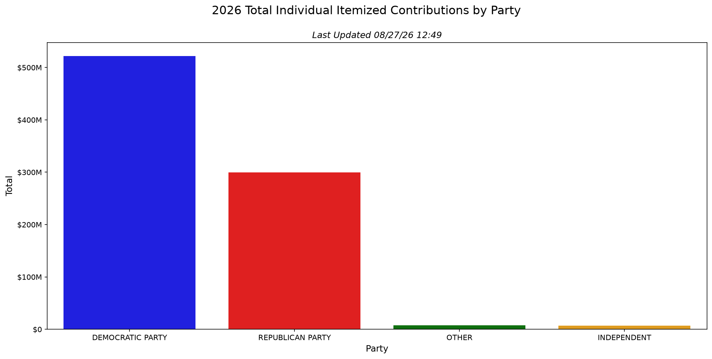
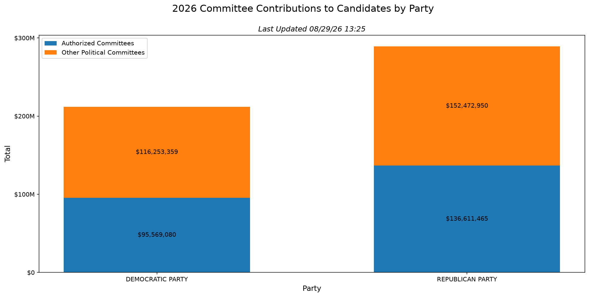

# FEC Contributions

This repo is for me to post visualizations based on data pulled directly from the FEC API:

https://api.open.fec.gov/developers/

Charts will have a timestamp clarifying the last time they were updated.

### 2026 Individual Contributions to Candidates by Party

## 2026 Committee Contributions to Candidates by Party

